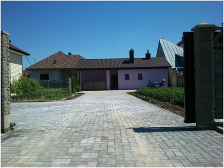
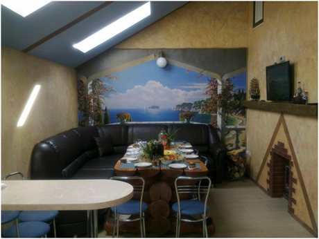

## Усадьба "Балтийский берег"

За отдых в усадьбе отвечает баня со СПА-процедурами. Вы можете арендовать домик из 3-х комнат (2 спальни и 1 гостиная) и в вашем распоряжении будет также деревенская баня.

В хозяйском доме расположен СПА-центр, где есть: инфракрасная сауна, СПА-бассейн на 4 места, массажное кресло, бильярд, плазменный телевизор, гриль.
Кают-компания оснащена кухонным блоком, снабженным всеми современными функциями, а комната поразит своими внушительными размерами, где удобно разместился диван с кожаным покрытием и огромный стол из натурального дерева ольха, вокруг которого могут свободно расположиться до 10 человек. Все свои вещи вы сможете разложить в удобном шкафе-купе Командор. Ну и, конечно же, не обойдется без телевизора широкоформатного размера с множеством каналов. В прохладное время согреет и создаст домашний уют камин, с друзьями можно посидеть за барной стойкой.

На территории агроусадьбы "Балтийский берег" есть парковка.
Центральным местом отдыха, конечно же, является парная, которая отделана деревом из липы и ольхи. Она возведена с соблюдением всех правил банного строительства. В парной установлена настоящая сибирская банная печь, которая дает возможность ощутить, как эффект русской бани, так и финской сауны. Для получения целебного «легкого» пара используется современный парогенератор и камни малинового кварцита, раскаленные до необходимого жара, а специальная система вентиляции позволить вдыхать только свежий воздух.