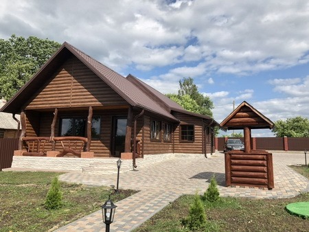
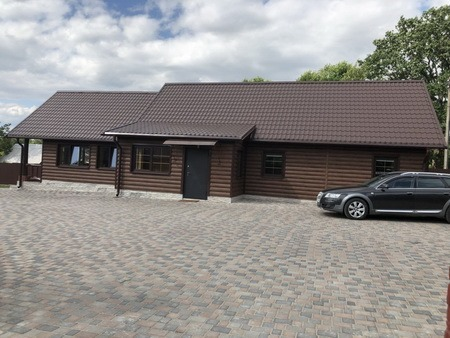

## Усадьба "Бублики" 

Агроусадьба "Бублики" расположена в Ивьевском районе Гродненской области. В усадьбе имеется просторный банкетный зал на 50 персон, где можно провести праздничные мероприятия. Также для праздников есть крытая беседка общей вместимостью до 40 человек.

В доме усадьбы "Бублики" сможет разместиться компания до 10 человек. Здесь есть все необходимые удобства: мебель и техника. На участке усадьбы распололожена печь-мангал, где вы сможете приготовить шашлык и уху. Также на территории есть парковка.

<iframe width="800" height="506" src="https://www.youtube.com/embed/kAzF1KaTceA" title="Агроусадьба Бублики" frameborder="0" allow="accelerometer; autoplay; clipboard-write; encrypted-media; gyroscope; picture-in-picture" allowfullscreen></iframe>

Усадьба расположена на реке Гавья,находится в деревне Шелути,в 10 км от г.Ивье и 25 км от г.Лида.
Отличное место,чтобы хорошо провести время.Отдых в деревне всей семьей,встречи с друзьями,коллегами,проведение мероприятий и просто отдых от городской суеты.

Печь мангал,оборудованный местом под казан и жаровней для кулинарных экспериментов. Большая,необычного дизайна,крытая беседка, позволяет насладиться приготовлением шашлыков, блюд на открытом огне и горячими напитками даже в зимний период.
Качели,гамак и для деток батут,смогут дополнить и разнообразить ваш отдых.
У вас будет возможность покупаться в одной из самых чистых рек Беларуси,реке Гавья,которая протекает в пару метрах от усадьбы.Сможете насладиться прекрасным закатом над рекой,пением птиц и просто природой!