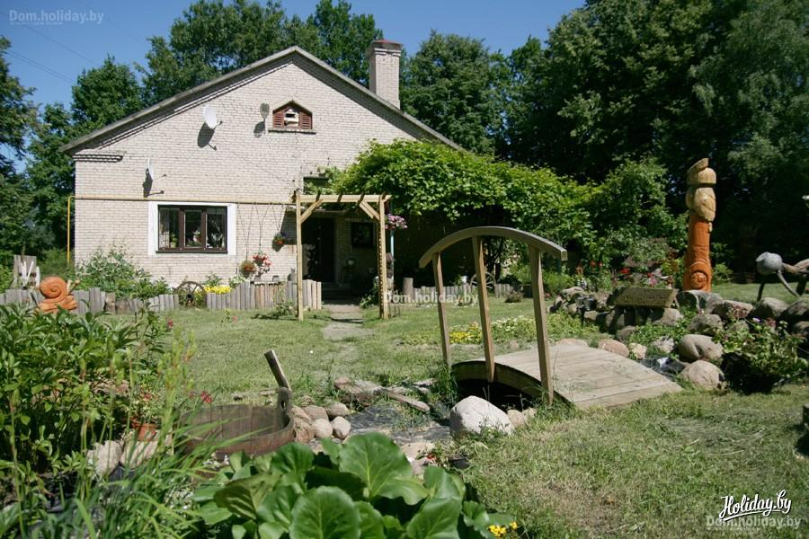
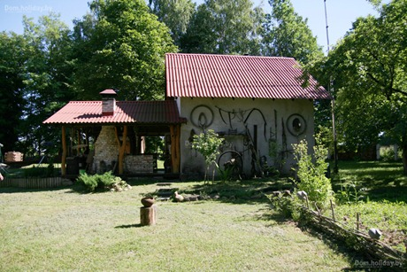
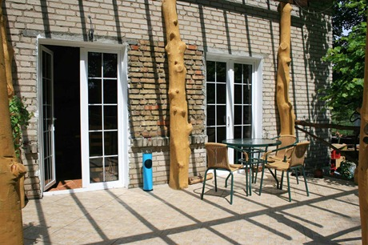

## Усадьба "Лидский хуторок"

>Усадьба «Лидский хуторок» расположена в городе, однако от городской суеты и шума ее прячут кроны высоких дубов, лип, берез. До ближайших построек более чем пятьсот метров, поэтому усадьба является своеобразным хутором.
Дом представляет собой современную постройку из белого кирпича. Здесь все продумано до мелочей: теплые полы, интерьер, в котором сочетаются элементы старины и современности.

Для гостей усадьбы подготовлены две спальни. В одной спальне стоит 2-ая кровать, в другой - две одноместные кровати, раскладной диван, а также печка-лежанка.
В доме есть банкетный зал с русской печью вместимостью 30 человек. Это помещение можно использовать для проведения торжеств, свадеб, а также в качестве конференц-зала, где можно проводить семинары. Тут есть домашний кинотеатр с большим телевизором и хорошей акустической системой. Из зала есть выход на террасу и кухню, где хозяева будут готовить для вас. Для гостей отведен отдельный санузел: туалет, биде, душ, умывальник.

Гости агроусадьбы смогут попариться в бане, где есть; парилка, душ, купель, санузел, а также комната отдыха. Баня по стилю напоминает охотничий домик, тут же на месте можно сделать шашлыки, уху, блины и др.
Территория во дворе усадьбы полностью облагорожена, имеются: пруд, качели, спортивная площадка, гамаки.

При желании для вас организуют экскурсии в близлежащие усадьбы, Жировичский монастырь, на стеклозавод «Неман», Лидский замок и Лидский пивоваренный завод. Также вы сможете поохотиться, порыбачить, увидеть настоящие рыцарские поединки, файер-шоу, насладиться живой музыкой.