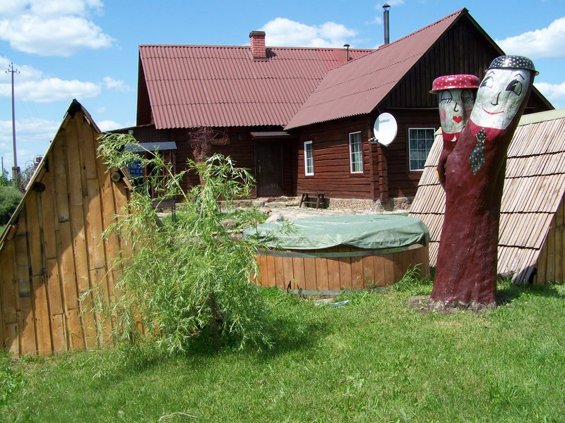
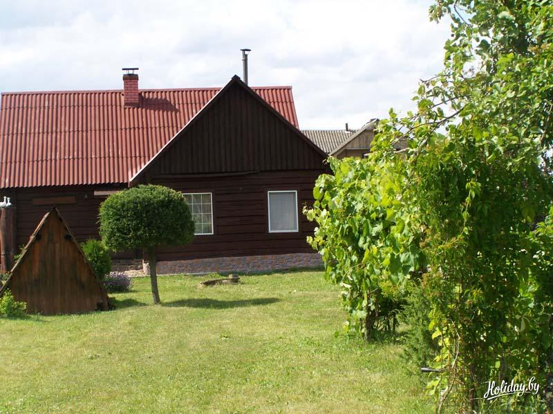
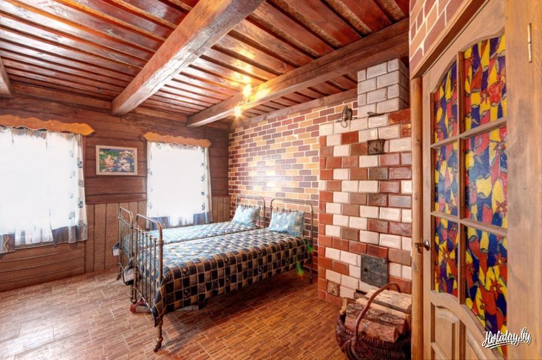

## Усадьба  "Каля Нёмана"

Отдых в деревне! Что может быть лучше и здоровей для уставшего от повседневных забот и суетливых будней человеческого организма! Только свежий воздух, прогулки по живописным хвойным лесам, звуки природы и спокойное течение жизни – всё это предлагает агроусадьба «Каля Нёмана».

Усадьба в аренду «Каля Нёмана» расположена в 10ти километрах от белорусского городка Ивье на территории заказника «Раздоры» Гродненской области. Настоящая белорусская деревня с традиционными домиками и укладом жизни!

Рядом с деревней – хвойные леса и широкие луга. Живописные пейзажи и расположенные рядом с усадьбой церкви обладают успокаивающим действием. Красивые деревенские домики вызывают желание в них побывать. И, несмотря на спокойный жизненный уклад, в деревне на самом деле всегда есть чем заняться – скучно здесь точно не бывает! Городскому жителю порой бывает интересно просто полюбоваться местными пейзажами и деревенскими домами, которые стоят уже по 60 лет. Все подворья в деревне ухоженные, утопающие в зелени и цветах. Красота деревни, в которой расположена усадьба, в том, что все картины счастливой жизни настоящие, они созданы трудом и любовью к своей среде обитания.

<iframe width="800" height="506" src="https://www.youtube.com/embed/cESbsQX13Yk" title="Проект "Туризм без чемодана. Ивье" frameborder="0" allow="accelerometer; autoplay; clipboard-write; encrypted-media; gyroscope; picture-in-picture" allowfullscreen></iframe>

В этом замечательном месте проходят настоящие свадьбы с элементами народных обрядов (обряд называется "Небесная арка"), а молодожены и гости катаются на конях с бубенцами. Так что если у вас есть желание начать семейную жизнь с удивительных традиционных обрядов, которые несут в себе идеи добра и процветания – обязательно приезжайте в усадьбу «Каля Нёмана». Хозяева усадьбы с удовольствием вам в этом помогут! Кроме того, возможна организация и других тематических мероприятий.

Рядом с белорусской агроэкоусадьбой протекает река Неман, тут можно отдохнуть на воде, порыбачить. Неподалеку находится лес, где можно насладиться прогулками по свежему воздуху или же поохотиться.

Сама агроусадьба "Каля Нёмана" представляет собой традиционный белорусский дом. Располагает двумя уютными спальнями. В доме имеется оборудованная душевая комната с горячей водой и парилка.

К вашим услугам просторная кухня с русской печью. Кухня оснащена всей необходимой посудой и бытовой техникой:
- микроволновая печь;
- газовая плита;
- холодильник;
- телевизор

Возможна организация экскурсий и трансфер в белорусскую усадьбу «Каля Нёмана». Экскурсии можно организовать также в город Ивье, расположенный неподалеку. Здесь есть Ивьевский родник – настоящее достояние всего города. Люди за водой ходят туда с 1914 года. Сюда приходят все гости города Ивье, и встречает их у родника прародительница Ивье "княжна Ева". Недавно около родника сооружена купель, которую освятил архиепископ Новогрудский и Лидский Гурий, воды источника теперь носят имя Архангела Михаила.